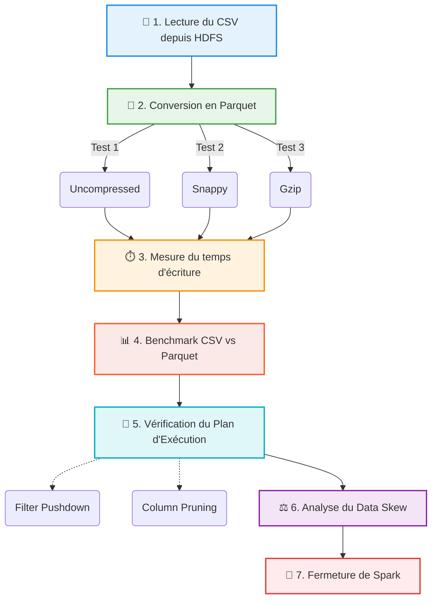

# Projet Big Data : L'Architecte du Stockage

[](https://spark.apache.org/)
[](https://hadoop.apache.org/)
[](https://www.docker.com/)

Ce projet a été réalisé dans le cadre de mon **Master 1 en Intelligence Artificielle**. L'objectif  est de démontrer l'efficacité du format de stockage colonnaire (Apache Parquet) face au format ligne (CSV) sur des environnements distribués, avec un focus sur l'économie de la bande passante I/O, un enjeu crucial pour le traitement de volumes massifs (Big Data).

##  Présentation du Projet

Le traitement de très grands datasets en format CSV traditionnel sature rapidement les disques et le réseau lors des lectures analytiques. Ce projet explore la migration vers **Apache Parquet**, un format colonnaire fortement compressé.

**Le cas d'usage :** Le dataset des Taxis de New York (NYC Yellow Taxi, ~2 Go).

**Les missions accomplies :**
1. Mise en place d'un cluster local distribué (NameNode, DataNode, Spark Master, Spark Worker) via Docker Compose.
2. Ingestion des données brutes (CSV) dans Hadoop HDFS.
3. Transformation et réécriture en Parquet avec différentes stratégies de compression (`Snappy`, `Gzip`, `Uncompressed`).
4. Analyse de performance (Benchmarking) et preuve de concept du **Column Pruning** et **Predicate Pushdown**.
5. Vérification de la bonne répartition de la charge (Data Skew).

##  Architecture Technique

L'infrastructure est entièrement conteneurisée via `docker-compose.yml` :
- **HDFS NameNode & DataNode** (Hadoop 3.2.1) : Stockage distribué.
- **Spark Master & Worker** (Spark 3.1.1) : Moteur de calcul distribué.
- Le dossier `./data` est monté dans les conteneurs pour injecter le CSV de test.
- Le dossier `./scripts` contient les jobs PySpark (`script_sujet1.py`).

## 🔄 Pipeline de Traitement (`script_sujet1.py`)

Voici le flux exact d'exécution de notre script d'analyse, modélisant les étapes de notre travail de bout en bout :



##  Résultats & Benchmarks

Les résultats obtenus démontrent un gain de performance massif en faveur du format Parquet compressé avec Snappy.

### ⚡ Accélération fulgurante (Boost x29.16)
Temps d'exécution pour une requête d'agrégation filtrée (`SELECT AVG(fare_amount) FROM table WHERE VendorID = 1`) :
- **Sur fichier CSV** : ~154 secondes.
- **Sur Parquet Snappy** : ~5.29 secondes.
- ** Gain de vitesse : x29.16**

###  Explication Technique : Column Pruning & Predicate Pushdown
Grâce au plan d'exécution physique généré avec `df.explain(extended=True)`, nous avons pu prouver que :
- **Column Pruning** : Spark ne lit sur le disque HDFS que les colonnes nécessaires à la requête (`fare_amount`, `VendorID`), ignorant le reste des 2 Go de données. Le CSV oblige Spark à lire la ligne entière à chaque fois.
- **Predicate Pushdown** : Le filtre `VendorID = 1` est "poussé" directement au niveau du fichier Parquet. Spark ne remonte en mémoire que les blocs de données contenant `VendorID = 1`, limitant drastiquement les opérations réseau/mémoire.

###  Répartition de la charge (Data Skew)
L'analyse des blocs Parquet montre une **distribution homogène** :
- Le dataset a été distribué sur **16 partitions HDFS**.
- La taille moyenne d'une partition est d'environ **20 Mo**.
- Aucun déséquilibre majeur (Data Skew) n'est à signaler, assurant qu'aucun DataNode ne créera de goulot d'étranglement réseau.

##  Instructions pour Lancer le Projet

### 1. Prérequis
- Avoir Docker et Docker Compose installés.
- Disposer du dataset `yellow_tripdata_2015-03.csv` placé dans le dossier `data/` à la racine (non inclus dans ce dépôt GitHub car > 2 Go).

### 2. Démarrage du cluster
Dans le terminal (PowerShell ou Bash) à la racine du projet :
```bash
# Lancement des conteneurs en tâche de fond
docker-compose up -d
```
*Patientez quelques secondes que le NameNode quitte le "safe mode".*

### 3. Exécution du Pipeline complet
Un script d'orchestration est fourni (`run_pipeline.bat` pour Windows ou `.sh` pour Linux). Il va :
1. Créer le dossier dans HDFS.
2. Copier le CSV lourd depuis `./data` vers le système HDFS interne.
3. Soumettre le job PySpark au cluster.

```bash
# Sur Windows :
.\run_pipeline.bat

# Sur Linux/Mac :
bash run_pipeline.sh
```


